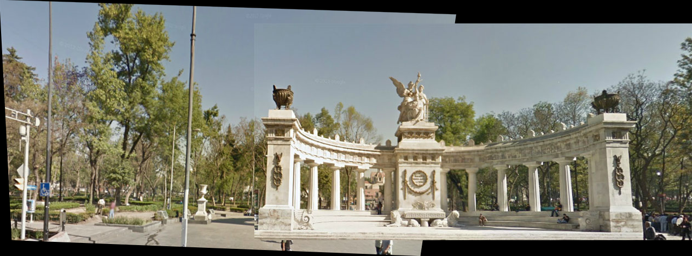

# BeyondTheFrame: Image Stitching

This project implements an image stitching algorithm to create panoramas from overlapping images using computer vision techniques. It leverages feature detection, matching, and homography estimation to align and blend images seamlessly.

## Overview

The panorama stitching process involves several key steps:
1. Feature detection using Harris corner detector
2. Feature description and matching
3. Homography estimation with RANSAC
4. Image warping and blending

## Key Parameters and Their Effects

### 1. RANSAC Threshold (Inlier Tolerance)
- The RANSAC threshold controls the allowable error when estimating the homography matrix.
- **Lower values** (e.g., 4.0, 8.0):
  - Stricter filtering of outliers, requiring very precise matches.
  - May discard correct matches in noisy images, potentially leading to unstable or failed stitching.
- **Higher values** (e.g., 16.0):
  - More lenient, allowing more matches to be considered inliers.
  - Useful for images with distortions or perspective changes, but may result in inaccurate warping or ghosting.

### 2. Ratio (Feature Matching Confidence)
- The ratio in Lowe's ratio test determines how distinct a feature match is from its second-best match.
- **Lower values** (e.g., 0.5, 0.65):
  - Stricter matching; only highly confident matches are retained.
  - Reduces false matches but may lose some correct ones, leading to gaps in stitching.
- **Higher values** (e.g., 0.75, 0.95):
  - More relaxed matching, increasing the number of matches.
  - May introduce incorrect matches, leading to misalignment or distorted stitching.

### Optimal Parameter Combinations
- Best balance observed at:
  - **RANSAC Threshold: 10.0, Ratio: 0.65**: Provides a good mix of accuracy and flexibility.
  - **RANSAC Threshold: 16.0, Ratio: 0.45**: Works well in cases where feature detection is sparse but requires extra flexibility in matching.
  - **RANSAC Threshold: 4.0, Ratio: 0.45**: Slightly relaxed matching while maintaining reasonable accuracy.

## How to Run the Project

1. **Setup Environment**:
   ```bash
   pip install numpy opencv-python matplotlib scipy
   ```

2. **Run the Stitching Process**:
   ```bash
   python main.py
   ```
   By default, this will stitch `Image_1.jpg` and `Image_2.jpg` using various parameter combinations.

3. **Customize Parameters**:
   - To use specific parameters, modify the `RANSAC_THRESHOLDS` and `RATIOS` lists in the `stitch_images` function.
   - To use different images, change the file paths in the function call at the bottom of `main.py`.

4. **View Results**:
   - Stitched panoramas will be saved in the `./results` directory with filenames indicating the parameters used.

## Results

Here are some of the best panorama results achieved with different parameter combinations:

### Best Overall Result

*RANSAC Threshold: 10.0, Ratio: 0.65 - Provides optimal balance between accuracy and flexibility*

### Additional Quality Results

| Parameter Combination | Result | Notes |
|---|---|---|
|  | RANSAC: 4.0, Ratio: 0.45 | Good accuracy with stricter outlier filtering |
|  | RANSAC: 16.0, Ratio: 0.45 | Handles perspective distortion well |
|  | RANSAC: 8.0, Ratio: 0.65 | Balanced approach with good feature retention |

### Parameter Effects Visualization

The following table demonstrates how different parameter combinations affect the stitching quality:

|   RANSAC Threshold |   Ratio |   Number of Matches |
|--------------------|---------|---------------------|
|                  2 |    0.45 |                  48 |
|                  2 |    0.65 |                 131 |
|                  2 |    0.75 |                 281 |
|                  2 |    0.80 |                 430 |
|                  2 |    0.95 |                1509 |
|                  4 |    0.45 |                  48 |
|                  4 |    0.65 |                 131 |
|                  4 |    0.75 |                 281 |
|                  4 |    0.80 |                 430 |
|                  4 |    0.95 |                1509 |
|                  8 |    0.45 |                  48 |
|                  8 |    0.65 |                 131 |
|                  8 |    0.75 |                 281 |
|                  8 |    0.80 |                 430 |
|                  8 |    0.95 |                1509 |
|                 10 |    0.45 |                  48 |
|                 10 |    0.65 |                 131 |
|                 10 |    0.75 |                 281 |
|                 10 |    0.80 |                 430 |
|                 10 |    0.95 |                1509 |
|                 16 |    0.45 |                  48 |
|                 16 |    0.65 |                 131 |
|                 16 |    0.75 |                 281 |
|                 16 |    0.80 |                 430 |
|                 16 |    0.95 |                1509 |


## Technical Implementation Details

- **Feature Detection**: Harris corner detector identifies distinctive points in each image
- **Feature Matching**: Descriptors are extracted around each keypoint and matched using Euclidean distance
- **Homography Estimation**: RANSAC algorithm robustly estimates the transformation between images
- **Image Warping**: Perspective transformation is applied to align images in a common coordinate system

## Contributing

Contributions to improve the project are welcome:

1. Fork the repository
2. Create a feature branch (`git checkout -b feature/amazing-feature`)
3. Implement your changes
4. Run tests to ensure functionality
5. Commit your changes (`git commit -m 'Add amazing feature'`)
6. Push to the branch (`git push origin feature/amazing-feature`)
7. Open a Pull Request

### Potential Improvements
- Implement multi-band blending for smoother transitions
- Add support for stitching multiple images
- Optimize performance for large images
- Implement automatic parameter selection based on image characteristics

## Troubleshooting

- **Not enough matches found**: Try adjusting the ratio to a higher value or decreasing the Harris detector threshold
- **Misaligned panorama**: Try a lower ratio value to ensure more accurate matches
- **Error in stitching**: Some parameter combinations may fail for certain images; try alternative parameters